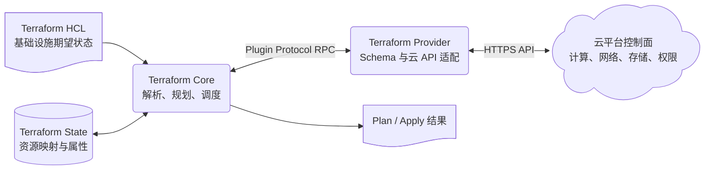
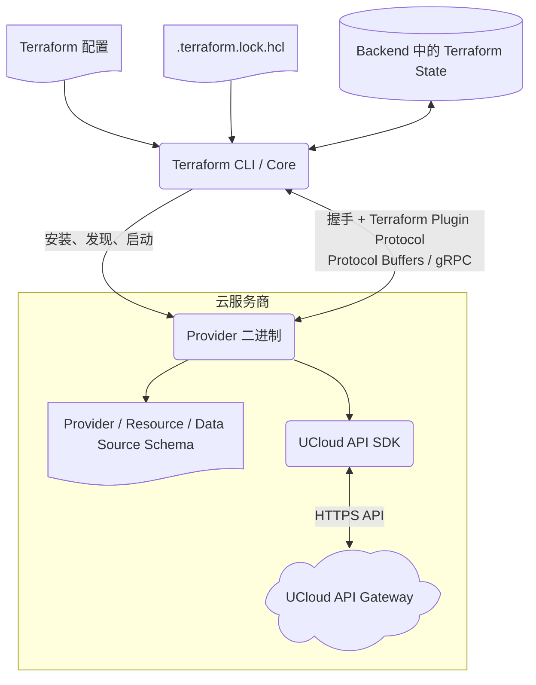
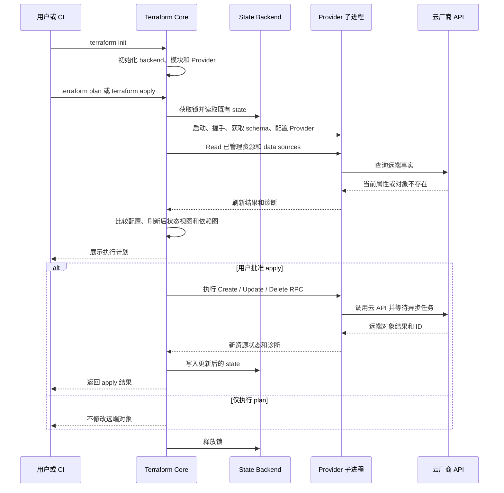

# Terraform Provider 工作模式与原理

> 研究日期：2026-08-17。本文优先采用 HashiCorp 官方文档、官方 GitHub 仓库与协议定义。命令、协议和 SDK 的细节会随版本演进，相关版本敏感点会单独说明。

## 1. Terraform 的作用

Terraform 是声明式基础设施管理工具。用户通过 HCL 描述基础设施的期望状态，Terraform Core 结合既有 state 和云端真实状态生成执行计划，再通过 Provider 调用云平台 API，使实际基础设施向配置声明的目标收敛。

Terraform 主要负责：

- 创建、读取、更新和删除云主机、网络、磁盘、负载均衡、数据库和权限等长期资源；
- 在执行前通过 `terraform plan` 展示预计变更；
- 使用 state 维护 Terraform 资源地址与远端对象 ID、属性之间的映射；
- 根据资源引用建立依赖图，并按依赖关系调度操作；
- 通过 Read 刷新远端事实，识别配置、state 与云端对象之间的差异；
- 支持资源导入、state 迁移、远端 backend 和协作锁定。

[`terraform plan` 官方文档](https://developer.hashicorp.com/terraform/cli/commands/plan)说明，默认规划会读取已有远端对象，比较当前配置和先前 state，并提出使远端对象符合配置的动作。

## 2. Terraform Core 与 Provider 的职责

Terraform 在逻辑上分为 Core 和 Provider 两部分。Provider 是独立可执行插件，不是 Terraform Core 内部的一组普通函数。

| 组件 | 主要职责 |
|---|---|
| Terraform CLI/Core | 解析 HCL、安装 Provider、表达式求值、维护依赖图、读取和写入 state、生成 plan、调度 apply、处理 backend 与锁 |
| Terraform Provider | 定义 Provider/resource/data source schema，校验配置，构造云 API 客户端，执行资源生命周期和数据查询 |
| State Backend | 持久化资源地址、远端 ID、属性和相关元数据；部分 backend 支持远端锁 |
| 云平台 API | 执行真实的资源创建、查询、修改、删除及异步任务 |

Core 决定“需要执行什么动作”，Provider 决定“如何通过目标平台 API 完成动作”。Provider 不负责整个依赖图，也不直接决定其他资源的执行顺序。

## 3. Provider 的发现、安装与进程模型

`terraform init` 初始化工作目录、backend、模块及 Provider 依赖。它可重复执行，不会删除已有配置或 state。[`terraform init` 参考](https://developer.hashicorp.com/terraform/cli/commands/init)

Provider 的典型装载过程如下：

1. Core 从配置中的 `required_providers` 取得 Provider 来源地址和版本约束。
2. Core 查询 Registry 或配置的镜像源，选择兼容版本。
3. Core 下载并校验 Provider 包，将选择结果和校验和记录在 `.terraform.lock.hcl`。
4. 执行 `validate`、`plan` 或 `apply` 时，Core 启动 Provider 独立进程。
5. Core 与 Provider 完成握手和协议协商。
6. Core 通过 RPC 请求 schema、配置校验、Read、Plan、Create、Update 或 Delete 等操作。
7. Terraform 命令结束后，Provider 进程退出或被停止。

Provider 来源、版本约束和 dependency lock file 共同保证构建与执行使用预期版本。[`terraform providers lock` 参考](https://developer.hashicorp.com/terraform/cli/commands/providers/lock)

`hashicorp/go-plugin` 提供通用的子进程启动、握手和连接管理能力。现代 Terraform Plugin Protocol 的权威定义使用 Protocol Buffers 和 gRPC；不能因为 `go-plugin` 同时支持 `net/rpc`，就认为现代 Provider 线协议可以任意选择二者。[Terraform Plugin Protocol](https://developer.hashicorp.com/terraform/plugin/terraform-plugin-protocol)；[`go-plugin` 官方仓库](https://github.com/hashicorp/go-plugin#architecture)

## 4. Plugin Protocol v5 与 v6

Terraform Plugin Protocol 是 Terraform CLI 与 Provider 之间的版本化接口。主版本定义兼容性边界，次版本以向后兼容方式增加能力。

| 协议 | CLI 兼容性 | 主要说明 |
|---|---|---|
| v5 | Terraform CLI 0.12+ | 可由 Plugin SDK v2、Plugin Framework 或低层 `terraform-plugin-go` v5 server 实现 |
| v6 | Terraform CLI 1.0+ | 包含 v5 Provider 能力，并增加 nested attributes、嵌套属性敏感性等能力 |

版本关系需要明确区分：

- Protocol v5/v6 是 CLI 与 Provider 的线协议版本，不是 Go module major version；
- `terraform-plugin-framework` 是较新的高层 Provider 开发框架；
- `terraform-plugin-sdk` v1 和 v2 是不同代际的旧 SDK；
- Framework 可以服务 Protocol v5 或 v6；SDK v2 通常服务 v5，也可以通过转换层参与 v6 组合；
- 不能从 SDK 的 module 版本直接推断 Provider 的完整线协议能力。

权威协议定义位于 Terraform CLI 仓库的 `.proto` 文件中。[Terraform Plugin Protocol v5/v6](https://developer.hashicorp.com/terraform/plugin/terraform-plugin-protocol)

## 5. Schema 与资源类型

Provider 通过 schema 向 Core 描述配置和状态结构。

### 5.1 Provider Schema

Provider schema 通常包含：

- API 凭证或凭证文件位置；
- Region、Project、租户等作用域；
- API endpoint；
- 重试次数、超时和 TLS 等客户端选项。

Provider 配置完成后，一般会构造云 API 客户端，并将其提供给后续 resource 和 data source 操作。

### 5.2 Managed Resource

Managed resource 表示由 Terraform 持续管理的远端对象，例如实例、VPC、磁盘或数据库。它需要处理：

- Create：创建远端对象并记录 ID；
- Read：查询远端事实并刷新 state；
- Update：修改可原地更新的属性；
- Delete：删除远端对象并清理 state；
- Import：将已存在对象纳入 Terraform 管理；
- State migration：在 schema 变化时升级旧 state。

### 5.3 Data Source

Data source 只读取外部信息，供其他配置表达式引用，例如查询镜像、可用区或已有网络。它不会获得 managed resource 的完整长期 CRUD 生命周期，但查询结果会参与本次 Terraform 状态和表达式求值。

## 6. `init`、`plan` 与 `apply` 生命周期

### 6.1 `terraform init`

`init` 负责准备执行环境，而不是创建业务资源：

- 初始化 backend；
- 下载模块；
- 安装符合约束的 Provider；
- 更新 dependency lock file；
- 检查工作目录是否具备后续操作条件。

### 6.2 `terraform plan`

`plan` 读取配置、先前 state 和远端事实，然后生成变更计划。默认不会执行所提议的资源变更。[`terraform plan` 参考](https://developer.hashicorp.com/terraform/cli/commands/plan)

需要区分“刷新规划时使用的状态视图”和“将刷新结果持久化到 backend”。普通 plan 主要生成计划；`-refresh-only` 模式专门检查并呈现外部变更。独立的 `terraform refresh` 已弃用，官方推荐使用 `terraform plan -refresh-only` 或 `terraform apply -refresh-only`。[`terraform refresh` 参考](https://developer.hashicorp.com/terraform/cli/commands/refresh)

### 6.3 `terraform apply`

`apply` 执行已有保存计划，或者先生成新计划并请求确认。Core 按依赖图调度 Provider RPC，并在操作成功后更新 state。[`terraform apply` 参考](https://developer.hashicorp.com/terraform/cli/commands/apply)

## 7. Terraform State

State 是 Terraform 管理长期资源的关键基线，主要保存：

- Terraform 资源地址与远端对象 ID 的映射；
- Provider 返回的对象属性；
- schema 和状态升级所需元数据；
- 部分依赖和实例展开信息；
- Provider 私有状态数据。

State 不是云平台事实的永久替代品。Terraform 在规划和执行期间仍需调用 Provider Read 查询真实对象，从而识别漂移、外部删除和最终一致性结果。

State 管理需要注意：

- 使用支持锁的远端 backend，避免并发写入；
- 将 state 视为敏感数据，其中可能包含凭证衍生信息或业务属性；
- 不直接手工修改 state 文件，优先使用 `terraform state`、`import`、`moved` 等受支持机制；
- 修改 state 前保留备份；官方文档说明会修改 state 的 `terraform state` 子命令会写备份文件。[`terraform state` 参考](https://developer.hashicorp.com/terraform/cli/commands/state)

## 8. 失败恢复、幂等与重试

Provider 的幂等目标是让相同配置与真实状态在收敛后得到空变更计划，而不是要求重复调用 Create 时完全不发送 API 请求。

Provider 实现应遵循以下原则：

- Create/Update/Delete 需要处理云 API 的异步任务、超时和最终一致性；
- Read 应以远端事实刷新 state，正确处理 404 和对象被外部删除；
- 暂态网络错误、限流和部分 5xx 错误可以进行有上限的退避重试；
- 认证失败、参数错误和明确业务冲突通常应快速失败；
- 所有等待和重试都应响应 context 取消；
- 若服务端已成功但响应丢失，应通过 Read、Import、请求幂等令牌或唯一属性查询恢复，不能简单再次创建；
- Update 部分成功时，应尽可能返回可确认的新状态和诊断，避免 state 与真实对象进一步偏离；
- Delete 遇到对象已不存在时，通常应视为删除目标已经达到。

## 9. 当前 UCloud Provider 仓库映射

当前仓库使用旧版 `terraform-plugin-sdk` v1.4.0：

- [`go.mod`](../go.mod) 固定 `github.com/hashicorp/terraform-plugin-sdk v1.4.0`；
- [`main.go`](../main.go) 调用 `plugin.Serve`，以 `ucloud.Provider` 作为 `ProviderFunc` 启动 Provider 服务；
- [`ucloud/provider.go`](../ucloud/provider.go) 使用 `schema.Provider` 定义 Provider schema；
- `DataSourcesMap` 注册只读查询；
- `ResourcesMap` 注册长期资源 CRUD 生命周期；
- `ConfigureFunc` 读取 Provider 配置并构造 UCloud API 客户端配置。

该实现属于旧 SDK 的 `schema.Provider` / `terraform.ResourceProvider` 编程模型，不能当作现代 `terraform-plugin-framework` 示例。尤其不能从 `plugin.Serve`、`ResourcesMap` 或 SDK v1.4.0 推导该代码已经采用 Framework 的 `providerserver.Serve`、Protocol v6 或 typed schema/plan modifier API。

SDK v1 升级到 v2 存在破坏性变化，例如 module 路径增加 `/v2`、移除旧 `terraform.ResourceProvider` 接口等。[SDK v2 Upgrade Guide](https://developer.hashicorp.com/terraform/plugin/sdkv2/guides/v2-upgrade-guide)

## 10. 参考资料

访问日期均为 **2026-08-17**：

1. HashiCorp, [How Terraform Works With Plugins](https://developer.hashicorp.com/terraform/plugin/how-terraform-works)。
2. HashiCorp, [Terraform Plugin Protocol](https://developer.hashicorp.com/terraform/plugin/terraform-plugin-protocol)。
3. HashiCorp, [Terraform Provider Servers](https://developer.hashicorp.com/terraform/plugin/framework/provider-servers)。
4. HashiCorp, [Terraform Framework RPCs](https://developer.hashicorp.com/terraform/plugin/framework/internals/rpcs)。
5. HashiCorp, [`terraform init`](https://developer.hashicorp.com/terraform/cli/commands/init)、[`plan`](https://developer.hashicorp.com/terraform/cli/commands/plan)、[`apply`](https://developer.hashicorp.com/terraform/cli/commands/apply)、[`refresh`](https://developer.hashicorp.com/terraform/cli/commands/refresh)、[`state`](https://developer.hashicorp.com/terraform/cli/commands/state)。
6. HashiCorp, [Terraform SDK v2 State Migration](https://developer.hashicorp.com/terraform/plugin/sdkv2/resources/state-migration) 与 [v2 Upgrade Guide](https://developer.hashicorp.com/terraform/plugin/sdkv2/guides/v2-upgrade-guide)。
7. HashiCorp, [`terraform-plugin-go` 官方仓库](https://github.com/hashicorp/terraform-plugin-go)。
8. HashiCorp, [`go-plugin` 官方仓库](https://github.com/hashicorp/go-plugin)。
