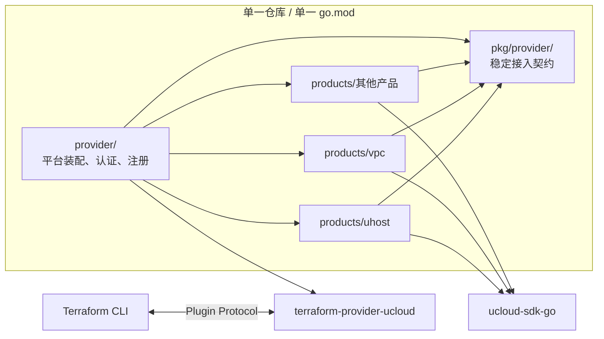
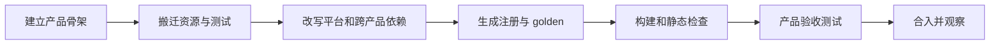

# Terraform Provider 产品化拆分与接入方案概览

<!-- markdownlint-disable MD013 -->

> 文档定位：面向技术评审和跨团队分享，概述产品化拆分的目标、架构、迁移路径和治理机制。实现细节以《Terraform Provider 产品化拆分与接入方案》为准。
>
> 当前状态：方案评审稿。本文描述的是目标态，其中的目录、命令和 CI 规则需要按实施阶段逐步落地。

## 1. 方案摘要

当前 UCloud Terraform Provider 将 47 个 Resource、34 个 DataSource 和平台能力放在同一个 `package ucloud` 中。所有资源由 `provider.go` 的大 map 集中注册，并直接依赖聚合了 20 个 SDK 连接的 `UCloudClient`。产品代码、平台代码和共享 helper 之间缺少明确边界，产品团队无法独立维护自己的资源。

本方案保留单仓库、单 `go.mod`、单 Provider 二进制，将代码重组为两层：

- 平台层维护 Provider 配置、认证、公共契约、注册、构建和发布；
- 产品层按 `products/<name>/` 分目录维护 Resource、DataSource 和产品测试。

所有启用的产品在编译期注册到同一个 Provider，用户仍安装和使用 `terraform-provider-ucloud`，已有资源类型、HCL 配置和 state 不因目录拆分发生变化。

实施分为两个阶段。阶段 0 先完成 SDK v2 升级、平台契约、兼容性基线和工具链建设，不搬产品代码；阶段 1 及后续批次再逐产品迁移。每一步都以 Provider Schema golden、构建检查和产品验收测试作为准入条件。

## 2. 为什么要拆

| 现状 | 直接影响 |
| --- | --- |
| 47 个 Resource、34 个 DataSource 平铺在 `package ucloud` | 产品边界不清，改动影响面难判断 |
| 81 项注册集中在 `provider.go` | 多产品并行开发容易产生冲突 |
| `UCloudClient` 聚合 20 个私有 SDK 连接 | 产品代码无法迁出当前包，新增产品还要修改平台聚合对象 |
| 产品间可直接调用函数、常量和连接 | 隐式依赖多，无法按目录独立维护 |
| 通用 helper 与产品域逻辑混放 | 平台接口持续膨胀，职责难以界定 |
| 产品改动统一由主仓维护者承接 | 平台团队成为业务迭代瓶颈 |

拆分要解决的是代码所有权和演进效率问题，不是把 Provider 拆成多个独立发行物。Terraform Registry 仍只发布一个完整的 UCloud Provider。

## 3. 目标与非目标

### 3.1 目标

1. 产品代码按目录自治，业务方可以在本产品范围内完成开发、测试和合入。
2. 平台只提供稳定、领域无关的接入契约，不承担产品 API 和资源生命周期实现。
3. 产品之间禁止代码级依赖，跨产品操作通过 `ucloud-sdk-go` 对应 service 包完成。
4. 保持 Provider 对用户的兼容性，包括资源名、Schema、HCL 配置和 state。
5. 用代码生成、静态检查和 CI 固化注册、边界、所有权及发布流程。
6. 为产品后续从 Plugin SDK v2 逐步迁移到 Plugin Framework 保留通道。

### 3.2 非目标

- 不拆分为多个仓库、多个 Go module 或多个 Provider 二进制；
- 不为各产品建立独立版本号和独立 Registry 发布流程；
- 不在本次目录拆分中主动调整已有资源 Schema 或 state 格式；
- 不要求所有产品在同一阶段迁移到 Plugin Framework；
- 不把产品域常量和业务 helper 收入平台公共包。

## 4. 目标架构



架构遵循以下约束：

- `provider/` 是平台应用层，负责 Provider Schema、配置、认证、产品聚合和服务启动；
- `pkg/provider/` 是产品可依赖的唯一平台契约，提供 `Context`、SDK client 工厂和领域无关 helper；
- `products/<name>/` 是产品所有权边界，一个 Terraform 资源类型只能归属一个产品；
- 产品实现放在各自的 `internal/` 下，利用 Go `internal` 规则阻止兄弟产品直接复用；
- 产品目录之间禁止 import，跨产品资源操作直接调用对应的 SDK service；
- 所有产品共享仓库锁定的 SDK 和 Terraform 依赖版本。

计划按 SDK service 和业务团队边界划分 16 个产品域：`uhost`、`uphost`、`vpc`、`unet`、`ulb`、`udisk`、`udb`、`umem`、`uk8s`、`ufs`、`us3`、`uads`、`iam`、`label`、`ipsecvpn`、`udpn`。账号级的 `ucloud_zones` 和 `ucloud_projects` DataSource 继续由平台维护。

### 4.1 目标目录

```text
terraform-provider-ucloud/
  provider/                    # 平台装配层
    provider.go
    config.go
    products.gen.go            # 产品注册生成物
    internal/                  # 认证、assume_role、Cloud Shell 等平台内部实现
  pkg/provider/                # 产品可使用的平台契约
    product.go
    context.go
    errors.go
    validate.go
    schemautil.go
  products/
    uhost/
      product.yaml             # name、owners、enabled
      product.go               # New() 薄壳
      product_gen.go           # 资源注册生成物
      testdata/schema.golden.json
      internal/                # Resource、DataSource、service、状态与转换逻辑
    vpc/
    ...
  hack/
    tfp/                       # gen、golden、check、sync、new
    owner-gate/                # PR 所有权和准入裁决
```

## 5. 核心机制

### 5.1 平台契约

每个产品实现统一的 `Product` 接口，向平台提供元数据、Resource 和 DataSource。产品通过 `pkg/provider.Context` 获取 Region、Project、平台配置和已注入认证信息的 SDK client。

SDK client 按需创建，不再由平台为每个产品维护一个连接字段。统一入口形态如下：

```go
conn := provider.NewServiceClient(ctx, uhost.NewClient)
```

需要调用其他产品 API 时，产品仍通过该入口构造对应 SDK service client，但不得 import 其他 `products/<name>` 目录。

### 5.2 编译期注册

Resource 和 DataSource 的工厂函数使用 `@Resource`、`@DataSource` 注解声明资源名。`hack/tfp` 扫描 Go AST 后生成两类文件：

- 产品内的 `product_gen.go`，生成本产品资源映射和元数据；
- 平台侧的 `products.gen.go`，聚合所有 `enabled` 产品。

资源声明只有一个事实来源。生成物提交到仓库，CI 通过重新生成和 `git diff --exit-code` 检查漂移。日常新增资源只修改本产品目录；新增或下线整个产品属于平台变更。

### 5.3 产品清单与所有权

每个产品使用 `product.yaml` 声明：

```yaml
name: uhost
owners: [github-user-a, github-user-b]
enabled: true
```

`owners` 用于 PR 准入判断，`enabled` 用于编译期注册。`enabled:false` 不能作为已发布产品的线上止血开关，否则 Terraform 将无法识别已有 state 中的资源类型。线上问题应通过 revert 后发布 patch 版本处理。

### 5.4 边界检查

产品目录只允许依赖标准库、`pkg/provider`、Terraform Plugin SDK/Framework、`ucloud-sdk-go` 和本产品代码。`hack/tfp check` 重点检查：

- 产品间 import 和平台内部 import；
- 绕过 `provider.NewServiceClient` 直接创建 SDK client；
- Resource、DataSource 重名及命名格式；
- `product.yaml`、注解和生成物的一致性；
- 产品 PR 修改平台、依赖、工作流或其他受保护路径；
- 用户诊断、日志和新增 Schema 描述是否符合平台规范。

这套规则与 Go `internal` 机制共同构成边界：编译器负责拦截内部实现复用，静态检查负责约束顶层包、依赖白名单和仓库治理规则。

## 6. 实施路径

### 6.1 阶段 0：平台重构，产品零搬迁

阶段 0 先建立迁移基础，主要工作包括：

1. 生成全量 Provider Schema golden，记录迁移前的用户兼容基线；
2. 将 `terraform-plugin-sdk` v1 升级到 v2，修正 Registry protocol 声明；
3. 接入 `tf5muxserver`，为 SDK v2 和 Plugin Framework 并存预留能力；
4. 建立 `pkg/provider`、`Product` 接口、`Context` 和按需 SDK client 工厂；
5. 将领域无关的错误、校验、转换和 Schema helper 收入平台契约；
6. 建立 `hack/tfp`、Schema golden、owner gate、生成物校验和构建矩阵；
7. 删除已确认的死代码和死连接。

阶段 0 不直接删除 `UCloudClient`。先建立新入口并保留兼容适配，待产品迁移时逐个替换 `client.xxxconn`；所有产品完成迁移后再删除聚合 client。这能把认证和连接初始化的变化控制在可验证的批次内。

阶段 0 的完成条件是：SDK v2 构建通过，Provider Schema golden 无未解释差异，state migration 用例通过，现有验收测试在可用测试环境中通过。

### 6.2 阶段 1 及后续：逐产品迁移

建议先迁依赖少、资源少的产品，验证工具链和治理流程，再处理跨产品调用集中的产品：

1. `label`、`udpn`、`us3`；
2. `iam`、`uads`、`ipsecvpn`、`ufs`、`uk8s`、`umem`、`udb`；
3. `udisk`、`ulb`、`uphost`；
4. `unet`、`vpc`、`uhost`。

每个产品按同一流程迁移：



单个产品只有在 Schema golden 无未批准差异、离线检查通过、该产品真实 API 验收完成后，才进入下一批迁移。

## 7. 兼容性与质量保障

### 7.1 用户兼容基线

目录调整本身不得改变：

- Resource 和 DataSource 类型名；
- Schema 字段名、类型和嵌套结构；
- `Required`、`Optional`、`Computed`、`ForceNew`、默认值等属性；
- state 结构、SchemaVersion 和 `StateUpgraders` 行为；
- Provider 配置字段及认证方式。

全量 Provider Schema golden 是硬门槛。任何快照差异都要说明原因、评估用户影响并经评审确认，不能以“只是搬文件”为由放行。

### 7.2 分层验证

| 验证层 | 主要内容 | 执行时机 |
| --- | --- | --- |
| 生成与边界 | 注解、注册、所有权、依赖白名单、命名冲突 | 本地 `make sync`、PR CI |
| 编译与静态检查 | `go build`、`go vet`、多平台交叉编译 | PR CI |
| 离线测试 | helper、迁移、资源逻辑的可离线部分 | PR CI |
| Schema golden | Provider 全量快照和产品快照 | 每个迁移批次、PR CI |
| Acceptance test | 真实 API 下的 CRUD、Import、state migration | 产品合入前、nightly 或专用环境 |

验收测试依赖真实凭证、配额和计费资源，不适合作为每个 PR 的同步门禁。产品方需要在 PR 中记录测试范围和结果；涉及删除路径、Schema 变化或 state migration 的 PR 应加 hold，经过人工确认后再合入。

## 8. 开发、准入与发布

目标态下，产品开发者主要使用：

```bash
make new-product NAME=uhost OWNERS=alice,bob
make sync
make verify
```

`make sync` 负责格式化、生成注册、构建、刷新 golden、检查边界并运行离线测试；`make verify` 以只检查、不改写文件的方式供 CI 使用。

产品自治 PR 需要同时满足所有权、改动范围、提交标题、生成物、测试和多平台构建要求。产品 owner 只能自动合入本产品目录内的常规改动；以下内容一律升级为平台 PR：

- `.github/workflows/**`、`hack/**`、`pkg/provider/**`、`provider/**`；
- `go.mod`、`go.sum`、`vendor/**` 和 Registry manifest；
- 其他产品目录；
- 本产品 `owners`、`enabled` 等所有权或发布面变更。

Provider 不采用“合并即发布”。发布继续由人工创建 `v*` tag 触发，产出单一版本的 Provider 二进制。发布后发现问题，revert 对应提交并发布 patch 版本，不删除已发布 tag 和 Release。

## 9. 责任边界

| 平台团队 | 产品团队 |
| --- | --- |
| Provider Schema、认证、endpoint、assume role、Cloud Shell | 本产品 Resource 和 DataSource 的实现 |
| `pkg/provider` 公共契约及兼容性 | API 参数、业务校验、状态轮询和错误语义 |
| 产品注册、命名冲突和边界检查 | Import、StateUpgraders 和产品兼容性 |
| SDK 版本锁定及升级编排 | 公有及 private API 适配 |
| Schema golden、构建、发布和 Registry | 产品测试、真实 API 验收、用户文档和示例 |

问题归属以最小复现边界为准：能在产品目录及 `Context` 下复现的问题由产品团队处理；只在平台组合、认证或发布链路中复现的问题由平台团队处理。

## 10. 主要风险与控制措施

| 风险 | 影响 | 控制措施 |
| --- | --- | --- |
| SDK v1 到 v2 的 CRUD 签名和诊断模型变化量大 | 可能引入运行时行为回归 | 机械改动脚本化，按模块审查，Schema golden 加全量验收 |
| `MigrateState` 改为 `StateUpgraders` | 错误迁移会破坏存量 state | 为每个已有版本保留迁移夹具和定向测试，作为阶段 0 硬门槛 |
| 跨产品直接调用未清理完整 | 拆分后编译失败或重新形成耦合 | 迁移前盘点调用，统一改走 SDK service，AST 规则持续拦截 |
| Acceptance test 成本高且可能 flaky | PR 自动化无法覆盖真实行为 | 专用账号、分产品测试、nightly、PR 留存结果，风险 PR 使用 hold |
| 产品 owner 未确认 | 自治 gate 无法启用 | 迁移前由各团队确认 GitHub handle 和备份 owner |
| 自动合并不包含真实 API 验收 | 缺陷可能进入主分支 | 限定自动合并范围，危险改动人工 hold，发布保留人工窗口 |
| `enabled:false` 被误作回滚 | 已有 state 无法加载资源类型 | 静态提示或限制该字段变更，线上统一采用 patch roll-forward |
| SDK v2 导致 vendor 依赖树大幅变化 | 构建环境或评审成本增加 | 阶段 0 单独评估保留 vendor 还是切换 Go modules，并先验证内网依赖可达性 |

## 11. 评审需要确认的事项

1. 是否接受“单仓单二进制、按产品目录自治”作为长期形态。
2. 是否接受产品目录间零 import 的严格边界，以及跨产品逻辑改走 SDK service 或在调用方保留域内实现的成本。
3. 是否同意先完成 SDK v2 和平台工具链，再开始产品搬迁。
4. 是否提交代码生成物，并以 CI diff 校验一致性。
5. 16 个产品域的划分、资源归属和对应 owner 是否准确。
6. Acceptance test 可用的账号、配额、预算、最长耗时和 flaky 处理方式。
7. 是否保留 `vendor/`，以及构建环境是否允许通过 Go proxy 获取依赖。
8. 是否启用产品 PR 自动合并；若启用，采用 merge queue 还是“分支必须最新 + 串行合并”。
9. `enabled:false` 是否仅允许用于从未发布或已确认无存量用户的产品。

以上事项确认后，阶段 0 的范围、负责人和验收口径才能固定。产品 owner 和验收测试资源是启动迁移前的前置条件。

## 12. 完成标准

方案落地完成应满足以下条件：

- 现有产品代码全部归入明确的 `products/<name>/` 目录，平台不再维护产品业务实现；
- `UCloudClient` 的产品 SDK 连接聚合已删除，所有产品通过统一工厂按需获取 client；
- 产品间无代码 import，跨产品 API 调用均经过允许的 SDK service；
- Provider Schema golden 无未批准差异，已有 state migration 测试通过；
- 产品可在不修改平台文件的前提下新增常规 Resource 或 DataSource；
- 所有权、边界、生成、构建和发布规则已由 CI 执行；
- Registry 仍发布一个兼容的 `terraform-provider-ucloud`，用户使用方式不变。
